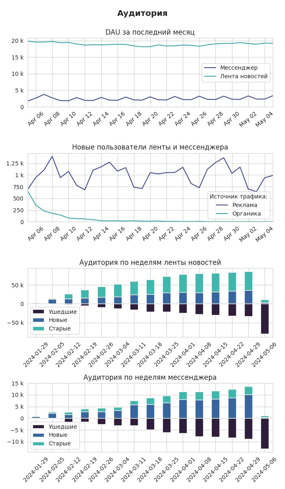
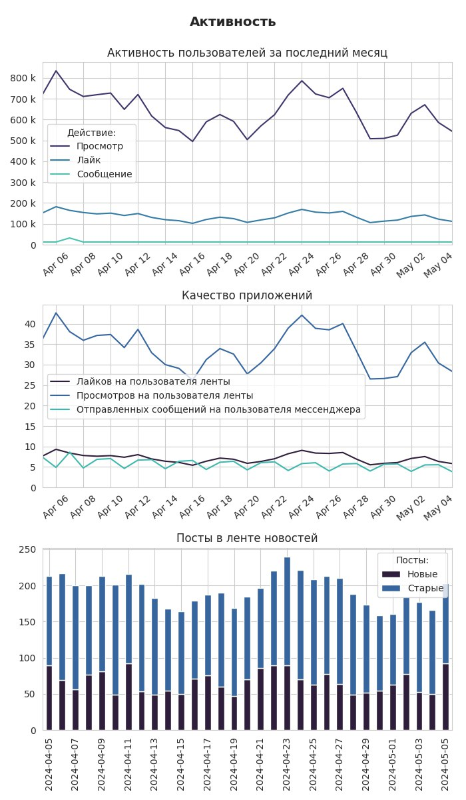

<h1>Автоматизация ежедневной отчетности приложения: лента новостей и мессенджер</h1>

DAG Airflow каждый день в 11 часов отправляет отчет по работе приложения.

<h2>Структура данных в ClickHouse</h2>
<h3>Таблица feed_actions</h3>
<table>
  <thead>
    <tr>
      <th>user_id</th>
      <th>post_id</th>
      <th>action</th>
      <th>time</th>
      <th>gender</th>
      <th>age</th>
      <th>country</th>
      <th>city</th>
      <th>os</th>
      <th>source</th>
      <th>exp_group</th>
    </tr>
  </thead>
  <tbody>
    <tr>
      <td>139605</td>
      <td>2243</td>
      <td>view</td>
      <td>07/03/24 00:00</td>
      <td>1</td>
      <td>23</td>
      <td>Russia</td>
      <td>Birsk</td>
      <td>iOS</td>
      <td>organic</td>
      <td>0</td>
    </tr>
    <tr>
      <td>138505</td>
      <td>2436</td>
      <td>view</td>
      <td>07/03/24 00:00</td>
      <td>0</td>
      <td>24</td>
      <td>Russia</td>
      <td>Rostov</td>
      <td>Android</td>
      <td>organic</td>
      <td>1</td>
    </tr>
    <tr>
      <td>140314</td>
      <td>2436</td>
      <td>like</td>
      <td>07/03/24 00:00</td>
      <td>1</td>
      <td>19</td>
      <td>Russia</td>
      <td>Yelizovo</td>
      <td>Android</td>
      <td>organic</td>
      <td>3</td>
    </tr>
  </tbody>
</table>

<h3>Таблица message_actions</h3>
<table>
  <thead>
    <tr>
      <th>user_id</th>
      <th>receiver_id</th>
      <th>time</th>
      <th>source</th>
      <th>exp_group</th>
      <th>gender</th>
      <th>age</th>
      <th>country</th>
      <th>city</th>
      <th>os</th>     
    </tr>
  </thead>
  <tbody>
    <tr>
      <td>112866</td>
      <td>110282</td>
      <td>07/03/24 00:00</td>
      <td>organic</td>
      <td>3</td>
      <td>1</td>
      <td>29</td>
      <td>Russia</td>
      <td>Moscow</td>
      <td>Android</td>
    </tr>
    <tr>
      <td>111607</td>
      <td>113653</td>
      <td>07/03/24 00:00</td>
      <td>organic</td>
      <td>1</td>
      <td>1</td>
      <td>20</td>
      <td>Russia</td>
      <td>Barnaul</td>
      <td>Android</td>
    </tr>
    <tr>
      <td>7401</td>
      <td>7800</td>
      <td>07/03/24 00:00</td>
      <td>ads</td>
      <td>0</td>
      <td>0</td>
      <td>17</td>
      <td>Azerbaijan</td>
      <td>Ağdaş</td>
      <td>iOS</td>
    </tr>
  </tbody>
</table>

<h2>Пример отчета</h2>

<blockquote>
  

    👨Аудитория👩  
     
    📰Лента новостей 
    DAU 05-05-2024: 19175 
    DAU 28-04-2024: 19017 
    Изменение: 0.8% 
     
    ✉️Мессенджер 
    DAU 05-05-2024: 3343 
    DAU 28-04-2024: 2210 
    Изменение: 51.3% 
     
    📈Новые пользователи
    C 29-04-2024 по 05-05-2024: 6864 
    C 22-04-2024 по 28-04-2024: 7248 
    Изменение: -5.3% 
     
    🪃Retention 
    1-го дня: 24.3% 
    7-го дня: 17.0% 
    14-го дня: 11.3%
  

</blockquote>

<blockquote>
  

    📉Активность📈 
     
    ❤️Лайков за 05-05-2024: 111920 (5.8 на пользователя) 
    ❤️Лайков за 28-04-2024: 131578 (6.9 на пользователя) 
    Изменение: -14.9% 
     
    👀Просмотров за 05-05-2024: 543727 (28.4 на пользователя) 
    👀Просмотров за 28-04-2024: 633584 (33.3 на пользователя) 
    Изменение: -14.2% 
     
    ✉️Сообщений за 05-05-2024: 12890 (3.9 на пользователя) 
    ✉️Сообщений за 28-04-2024: 12901 (5.8 на пользователя) 
    Изменение: -0.1%
  

</blockquote>

